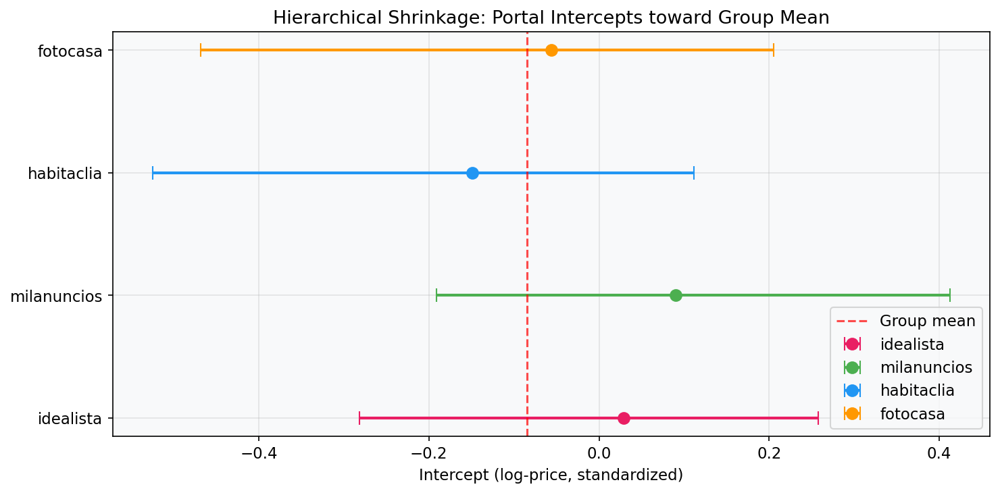
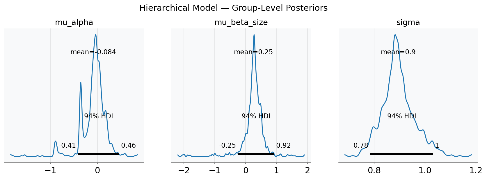
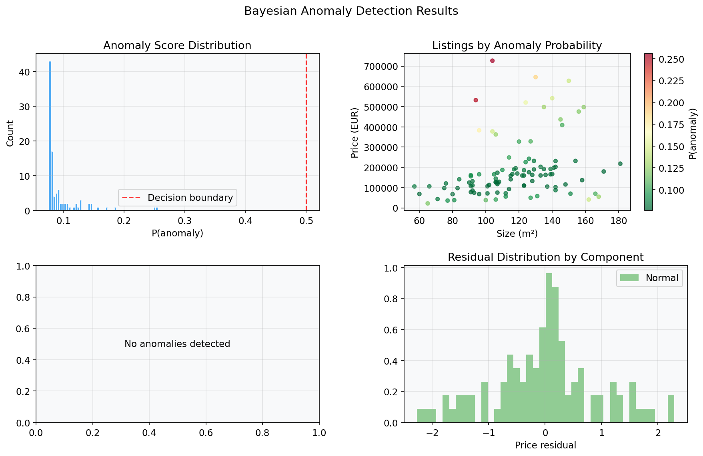
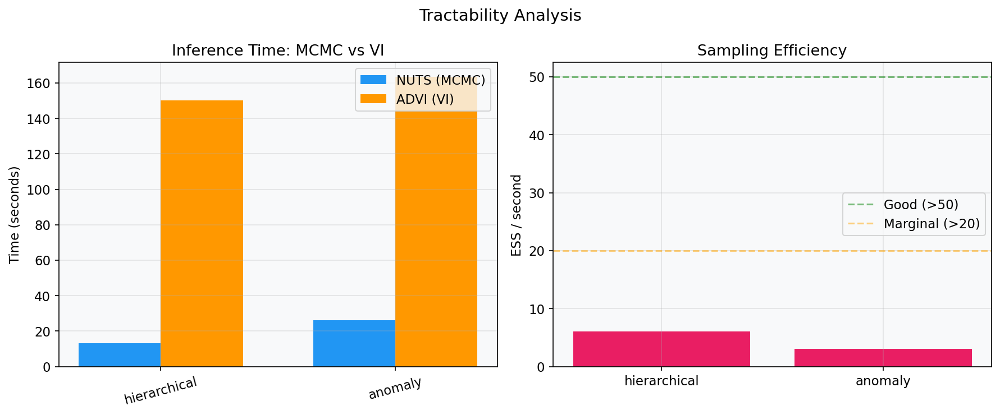

<p align="center">
  <h1 align="center">Bayesian Real Estate Intelligence</h1>
  <p align="center">
    Probabilistic modeling for multi-portal real estate market analysis
    <br />
    <a href="#models">Models</a> &middot; <a href="#results">Results</a> &middot; <a href="#quick-start">Quick Start</a> &middot; <a href="#tractability">Tractability</a>
  </p>
</p>

<p align="center">
  
  
  
  
</p>

---

A probabilistic programming framework that applies **hierarchical Bayesian models**, **Gaussian Process spatial regression**, and **mixture-model anomaly detection** to real estate listing data scraped from four Spanish portals.

Built on [PyMC 5](https://www.pymc.io/), [ArviZ](https://arviz-devs.github.io/arviz/), and [nutpie](https://github.com/pymc-devs/nutpie) (Rust-based NUTS sampler).

## Models

| # | Model | Technique | What it does |
|---|-------|-----------|--------------|
| 1 | **Hierarchical Pricing** | Multi-level partial pooling | Estimates price drivers per portal while sharing statistical strength across all four portals via group-level hyperpriors |
| 2 | **Spatial GP** | Gaussian Process, Matern-5/2 kernel | Learns a continuous price surface over geographic coordinates with calibrated uncertainty — no hand-crafted spatial features needed |
| 3 | **Anomaly Detection** | Bayesian mixture model | Classifies each listing into "normal market" vs "anomaly" components, yielding a posterior probability of being mispriced |

### Mathematical Detail

**Hierarchical model** — partial pooling across $J$ portals:

$$\alpha_j \sim \mathcal{N}(\mu_\alpha, \sigma_\alpha), \quad \beta_j \sim \mathcal{N}(\mu_\beta, \sigma_\beta)$$
$$y_i \sim \mathcal{N}\!\left(\alpha_{j[i]} + \mathbf{x}_i^\top \beta_{j[i]},\; \sigma\right)$$

**Spatial GP** — Matern-5/2 covariance over lat/lon:

$$f \sim \mathcal{GP}\!\left(0,\; \eta^2 \cdot k_{5/2}(d / \ell)\right), \quad y_i \sim \mathcal{N}(f(\mathbf{s}_i) + \mathbf{x}_i^\top \beta,\; \sigma)$$

**Anomaly mixture** — two-component on price residuals:

$$z_i \sim \text{Cat}(w), \quad r_i \mid z_i{=}k \sim \mathcal{N}(\mu_k, \sigma_k)$$

## Results

### Hierarchical Shrinkage

Portal-level intercepts pulled toward the group mean — portals with fewer listings borrow more strength:

<p align="center">
  
</p>

### Group-Level Posteriors

Posterior distributions for the hierarchical hyperparameters:

<p align="center">
  
</p>

### Anomaly Detection

Mixture-model identifies overpriced/underpriced listings with calibrated anomaly scores:

<p align="center">
  
</p>

### Tractability Analysis

Comparison of MCMC (NUTS via nutpie) vs Variational Inference (ADVI), plus sampling efficiency (ESS/s):

<p align="center">
  
</p>

## Quick Start

```bash
git clone https://github.com/gilito11/bayesian-realestate.git
cd bayesian-realestate
pip install -r requirements.txt
```

```bash
# Quick demo (~6 min, synthetic data)
python demo.py --quick --no-spatial

# Full run with all three models (~20 min)
python demo.py

# With real data from PostgreSQL
python demo.py --source neon --database-url $DATABASE_URL
```

### CLI Options

| Flag | Description |
|------|-------------|
| `--quick` | Fewer MCMC draws for faster iteration |
| `--no-spatial` | Skip the GP model (slowest due to O(n^3) scaling) |
| `--n-listings N` | Number of synthetic listings to generate (default: 800) |
| `--source neon` | Load real data from Neon PostgreSQL |
| `--output-dir DIR` | Where to save plots (default: `output/`) |

## Architecture

```
bayesian_realestate/
├── models/
│   ├── hierarchical.py    # Multi-level partial pooling across portals
│   ├── spatial.py          # GP spatial regression (Matern-5/2)
│   └── anomaly.py          # Two-component Bayesian mixture
├── data.py                 # Synthetic data generator + Neon DB loader
├── diagnostics.py          # R-hat, ESS, divergences, model comparison
├── plots.py                # Publication-quality visualizations
└── demo.py                 # Full pipeline entry point
```

## Tractability

Each model includes a tractability analysis comparing inference methods:

- **NUTS** (No U-Turn Sampler) via [nutpie](https://github.com/pymc-devs/nutpie) — exact posterior samples
- **ADVI** (Automatic Differentiation Variational Inference) — fast approximate posterior
- **ESS/s** (Effective Sample Size per second) — sampling efficiency metric
- **R-hat** convergence diagnostics and divergence counts

The GP model demonstrates the tractability/expressiveness trade-off: Matern-5/2 gives rich spatial structure but scales as O(n^3), requiring subsampling for large datasets.

## Tech Stack

| Component | Technology |
|-----------|-----------|
| Probabilistic programming | PyMC 5.x |
| MCMC sampler | nutpie (Rust) with PyMC fallback |
| Posterior analysis | ArviZ |
| Data | pandas, NumPy |
| Database | PostgreSQL (Neon serverless) via psycopg2 |
| Visualization | matplotlib, seaborn |

## Data Sources

The framework operates in two modes:

1. **Synthetic** (default) — Generates realistic listings across 8 zones on the Tarragona coast with known ground truth anomalies. Useful for validating model recovery.
2. **PostgreSQL** — Connects to a live database of listings scraped from habitaclia, fotocasa, milanuncios, and idealista.

## License

MIT

## Author

**Eric Gil** — BSc Computer Science, Universitat de Lleida
